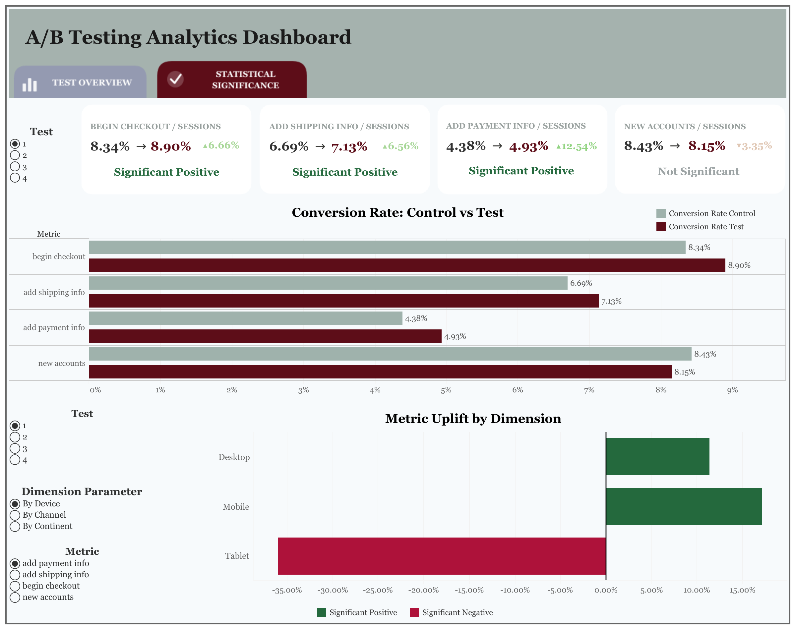
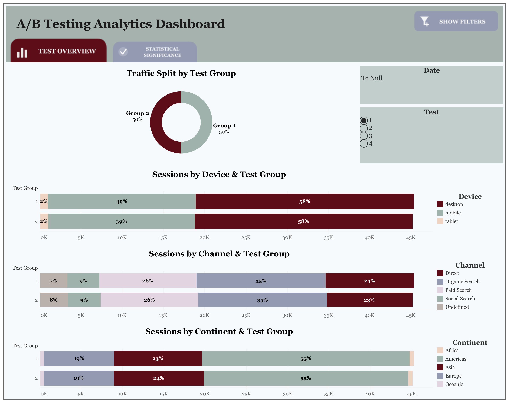

# A/B Testing Framework

A comprehensive A/B testing analysis report for an e-commerce platform, built using SQL, Python, and Tableau. The framework evaluates the impact of four A/B tests on key conversion metrics and assesses statistical significance across multiple dimensions (device, continent, country, channel) to identify which variations drive meaningful improvements in user behavior.

**[View Interactive Dashboard (Tableau Public)](https://public.tableau.com/views/ABTesting_17716044091480/StatSignificance?:language=en-US&:sid=&:redirect=auth&:display_count=n&:origin=viz_share_link)**

## Dataset

Extracted from Google BigQuery (DA dataset), covering **87 days** of user activity (Nov 1, 2020 - Jan 27, 2021). Combines **4 distinct A/B tests**, each with a control (Group 1) and test (Group 2) variant.

## Methodology

Statistical significance was determined using a **two-proportion z-test** at a 95% confidence level (α = 0.05). The analysis was built as a reusable, parameterized framework: a Python function computes conversion rates, uplift, and p-values dynamically across any number of metrics and grouping dimensions (test, device, channel, continent, country).

## Tools Used

- **SQL + Google BigQuery** - data extraction, table joins, initial aggregation
- **Python** (pandas, numpy, statsmodels) - data transformation and statistical significance calculation (z-test)
- **Tableau Public** - interactive dashboard for visualizing test outcomes

## Results

Out of 16 total metric × test combinations at the overall level, **6 were statistically significant (p < 0.05)**:

| Test | Metric | Uplift | p-value | Direction |
|---|---|---|---|---|
| Test 1 | add_payment_info | +12.54% | 0.0001 | Positive |
| Test 1 | add_shipping_info | +6.56% | 0.0092 | Positive |
| Test 1 | begin_checkout | +6.66% | 0.0029 | Positive |
| Test 2 | - | - | - | No metric reached significance |
| Test 3 | begin_checkout | −3.35% | 0.0120 | Negative |
| Test 4 | begin_checkout | −2.35% | 0.0459 | Negative |
| Test 4 | new_accounts | −3.36% | 0.0175 | Negative |

**By segment:**
- **Device** - tablets consistently underperform across Tests 1, 3, and 4 (negative uplift for begin_checkout and add_payment_info), suggesting the variants aren't optimized for tablet UX
- **Channel** - Direct traffic in Test 1 shows the strongest gains (+35.83% add_payment_info, +14.72% begin_checkout); Organic Search shows negative uplift for begin_checkout across all four tests
- **Continent** - Europe in Test 1 shows strong positive uplift (+40.32% add_payment_info, +15.44% add_shipping_info); results vary meaningfully by region
- **Country** - 293 significant results at the country level, but many rely on small sample sizes and should be treated cautiously; major markets (US, UK, Canada, India) are more reliable - Canada and India both show strong positive uplift in Test 1

## Key Insights

1. **Test 1 is the winner** - the only test with statistically significant positive uplift across multiple metrics at the overall level. Recommend rolling out the Test 1 variant to all users.
2. **Tablet experience needs attention** - negative results across multiple tests suggest a separate tablet-optimized variant should be considered.
3. **Geographic heterogeneity is high** - the same test produces opposite results in different countries/continents, arguing against a one-size-fits-all rollout.
4. **Organic Search users respond differently** - negative uplift for begin_checkout via organic traffic suggests these users may need a different funnel approach.
5. **Tests 3 and 4 are harmful** - both show statistically significant negative uplift for key metrics and should **not** be deployed.

## Repository Contents

- SQL queries for data extraction from BigQuery
- Python/Jupyter notebook with the parameterized significance-testing framework
- Exported results (`ab_test_results.csv`)
- Tableau Public interactive dashboard:

