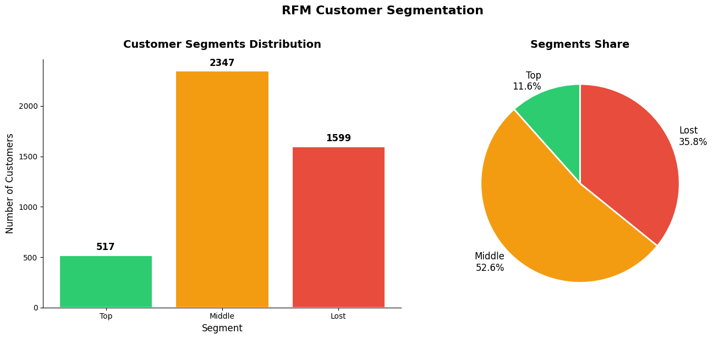

# RFM Customer Segmentation (Email Engagement)

Customer segmentation of email subscribers using the RFM framework (Recency, Frequency, Monetary), combining a SQL data extraction step with Python-based scoring, segmentation, and visualization.

## Business Context

The business wants to understand which email subscribers are most valuable and which are disengaging, in order to prioritize retention efforts and target win-back campaigns effectively.

## Dataset

Extracted from Google BigQuery (`DA` dataset) via a SQL query joining account, session, and email event tables. **4,463 accounts** with at least one email open, each with:
- `visit_cnt` - number of distinct emails opened
- `last_visit_date` - date of the most recent email open
- `revenue` - modeled at $10 per opened email

## Tools Used

- **SQL + Google BigQuery** - data extraction, joining account/session/email_visit/email_open tables
- **Python** (pandas, matplotlib, seaborn) - RFM scoring, segmentation logic, visualization

## Methodology

For each account, three metrics were calculated relative to the most recent activity date in the dataset (2021-02-25):

- **Recency** - days since last email open
- **Frequency** - total number of emails opened
- **Monetary** - total modeled revenue ($10 × opens)

Each metric was split into quartile-based bins (R: 1–3, F/M: 1–3) using the 25th/50th/75th percentiles of the distribution, then averaged into a single `rfm_value` score used to assign each account to a segment:

- **Top** (rfm_value ≥ 2.5)
- **Middle** (1.5 ≤ rfm_value < 2.5)
- **Lost** (rfm_value < 1.5)

## Results

| Segment | Accounts | Share | Profile |
|---|---|---|---|
| **Top** | 517 | 11.6% | Opened an email within the last 38 days, 6+ opens total, $450+ revenue |
| **Middle** | 2,347 | 52.6% | Opened 38–80 days ago, 3–6 opens, $180–450 revenue |
| **Lost** | 1,599 | 35.8% | Opened 80+ days ago, low frequency, minimal revenue |

## Recommendations by Segment

**Top (11.6%)** - the most active subscribers: they opened emails recently (within the last 38 days), do so frequently (6+ times), and generate the highest revenue ($450+). These customers should be encouraged to remain engaged with the email channel through personalized communication, exclusive offers, and loyalty programs.

**Middle (52.6%)** - the largest segment of the customer base: they last opened emails 38-80 days ago, have 3-6 visits, and generate $180-450 in revenue. This segment should remain a key engagement target. Regular communication with valuable content and targeted incentives can help move some customers into the Top segment.

**Lost (35.8%)** - a significant share of the customer base. These customers have not opened emails for 80+ days, have low engagement frequency, and generate minimal revenue. They should first be targeted with a **win-back or reactivation campaign**, using relevant offers or personalized content to encourage renewed engagement. Customers who remain inactive after the reactivation attempt can then be gradually excluded from regular email communication to reduce unnecessary messaging.

## Repository Contents

- SQL query for data extraction from BigQuery
- Python/Jupyter notebook - RFM calculation, segmentation logic, and visualizations
