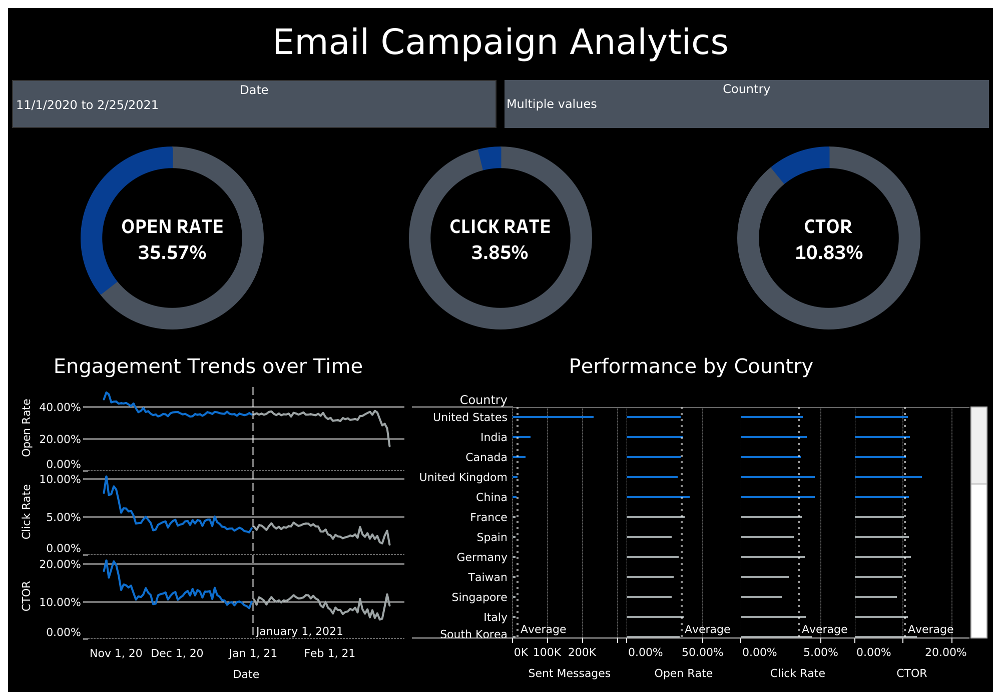
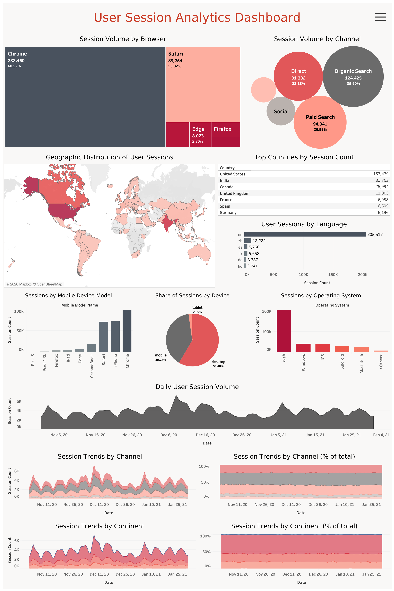
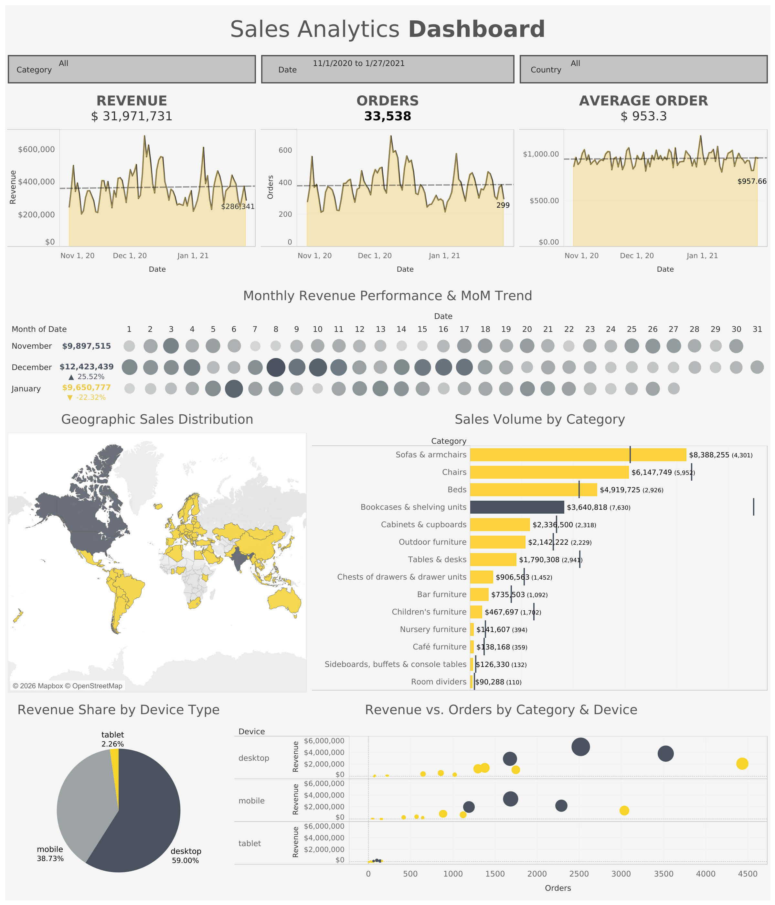
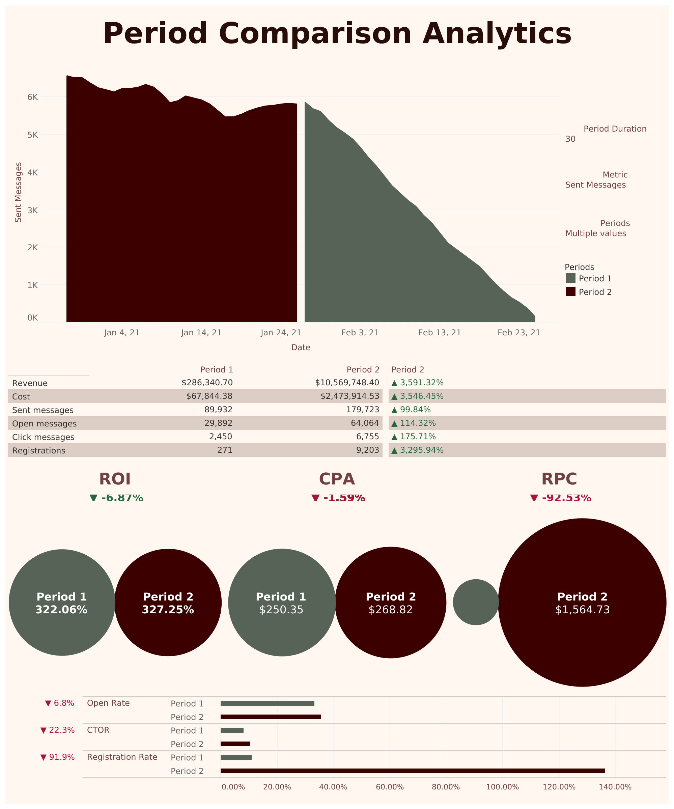
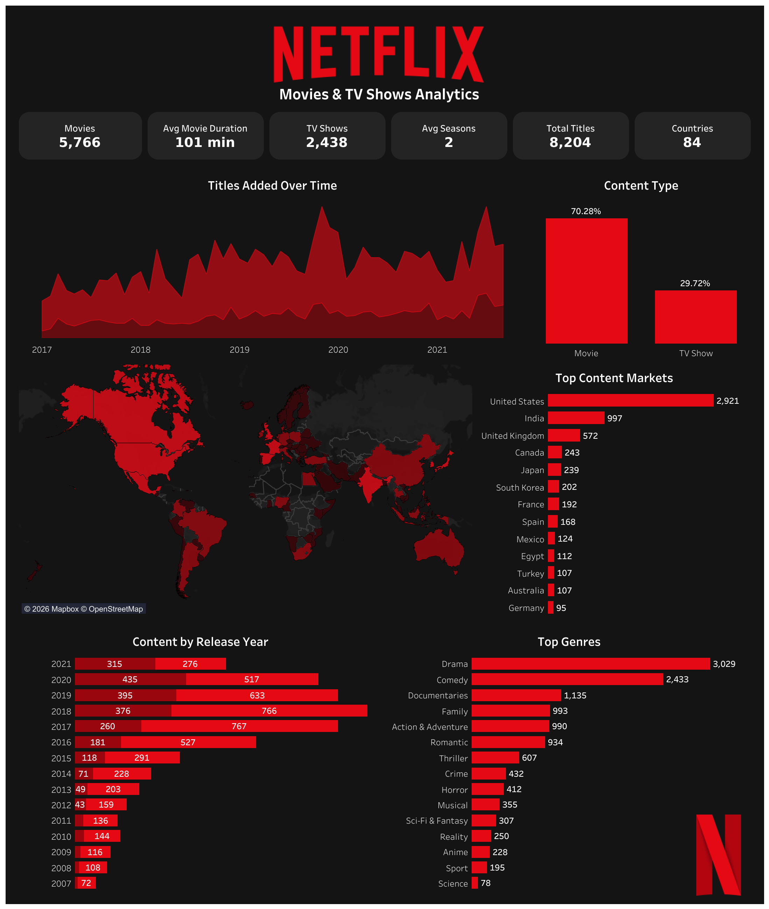

# Tableau Projects

Five standalone Tableau dashboards, each built on a different dataset and chart vocabulary - from KPI scorecards to geographic maps to before/after period comparisons.

---

## Email Campaign Analytics

Email engagement performance over a 4-month period (Nov 2020 - Feb 2021): Open Rate (35.57%), Click Rate (3.85%), and Click-to-Open Rate (10.83%), with engagement trends over time and a country-level breakdown of sent messages and rates.

[View on Tableau Public](https://public.tableau.com/views/EmailMetrics_17684914175520/EmailMetrics?:language=en-US&:sid=&:redirect=auth&:display_count=n&:origin=viz_share_link)

---

## User Session Analytics

Session volume breakdown by browser and traffic channel, with a geographic map and top-countries ranking to identify where user activity is concentrated.

[View on Tableau Public](https://public.tableau.com/views/SessionAnalytics_17683038907660/Dashboard1?:language=en-US&:sid=&:redirect=auth&:display_count=n&:origin=viz_share_link)

---

## Sales Analytics

Filterable KPI dashboard (by category, date, country) covering revenue ($31.97M), orders (33,538), and average order value ($953.30), with monthly revenue trend, sales volume by furniture category, geographic distribution, and revenue share by device type.

[View on Tableau Public](https://public.tableau.com/views/SalesAnalytics_17684215221180/Sales?:language=en-US&:sid=&:redirect=auth&:display_count=n&:origin=viz_share_link)

---

## Period Comparison Analytics

Side-by-side before/after comparison of two custom date periods for email campaign performance - revenue, cost, sent/open/click messages, and registrations - alongside efficiency metrics (ROI, CPA, RPC) and funnel rates (Open Rate, CTOR, Registration Rate).

[View on Tableau Public](https://public.tableau.com/views/DynamicDashboard_17685799735530/DynamicDashboard?:language=en-US&:sid=&:redirect=auth&:display_count=n&:origin=viz_share_link)

---

## Netflix Movies & TV Series

Content library analysis of 8,204 titles across 84 countries: movie/TV show split (70/30), titles added over time, top genres (Drama, Comedy, Documentaries), content by release year, and top content markets (US, India, UK leading).

[View on Tableau Public](https://public.tableau.com/views/NetflixMoviesTVSeries/Dashboard2?:language=en-US&:sid=&:redirect=auth&:display_count=n&:origin=viz_share_link)

